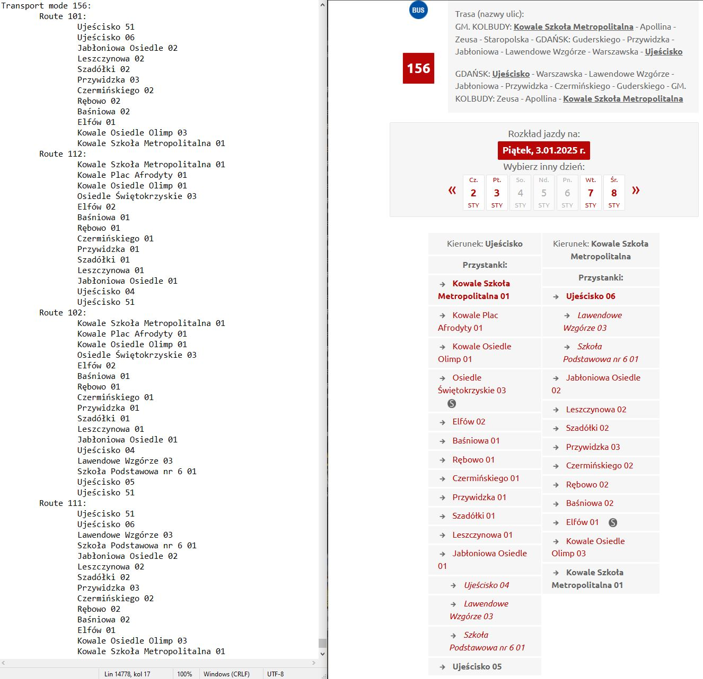
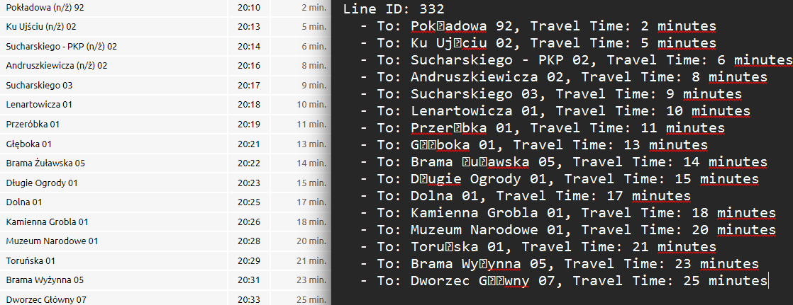

# GTFS Data Verification

## Introduction

The goal is to verify the consistency of data obtained and processed from GTFS files with information available on platforms such as Jakdojade.

Preliminary research focused on the open data provided by ZTM Gdańsk, specifically the data contained in `stop.txt` and `stop_times.txt`.

## Data Format

The data in the `stop_times.txt` file is structured as follows:

```
trip_id,arrival_time,departure_time,stop_id,stop_sequence,pickup_type,drop_off_type,stop_headsign
401202412290357_322_401-04,27:57:00,27:57:00,195,0,0,1,
401202412290357_322_401-04,27:58:00,27:58:00,1959,1,3,3,
401202412290357_322_401-04,27:59:00,27:59:00,1957,2,3,3,
401202412290357_322_401-04,28:02:00,28:02:00,194,3,3,3,
...
```

The `trip_id` can be divided into the main identifier, a variant identifier (route), and a task identifier (vehicle).

From the provided example, it can be determined that the data pertains to bus/tram 401 and its corresponding route 322.

In combination with this data, information about the stop name and coordinates is retrieved from the `stops.txt` file using a common identifier:

```
stop_id,stop_name,stop_lat,stop_lon,stop_code
102,Port Lotniczy 02,54.382731667792,18.467678105692,102
103,Port Lotniczy 03,54.382795163309,18.467704998868,103
128,Migowo 03,54.352862414818,18.576465883798,128
132,Orunia Górna 01,54.325188900112,18.618312716366,132
...
```

## Script

For the data used to determine graph connections, connections between stations are grouped by routes. This is due to their uniqueness, as dividing based solely on the mode of transport would not be sufficient.

However, when attempting to compare data with Jakdojade, a clear record with descriptions of different bus/tram lines is required.

In this case, a new script, `ztm_transport_trips.py`, will process the data into a readable format for handling the routes of each mode of transport as a file named `transport_routes.txt`.

## Comparison of Results

A comparison was conducted for a randomly selected bus schedule for route 156 available at [ZTM Gdańsk Bus 156 Schedule](https://ztm.gda.pl/rozklady/linia-156.html). Below is a graphical interpretation:



The GTFS data correctly represents information related to the route layout with a breakdown of possible station combinations. However, a noticeable difference arises in the presence of additional stations such as "Ujeścisko 51," which, upon map verification, might not be included in the Jakdojade route due to being a turnaround station between opposite routes.

## Comparison of travel times

The travel times were compared based on the data obtained from the merged file (merged_connections.py) and the values available on the official ZTM Gdańsk website (https://ztm.gda.pl/). The comparison reveals that the travel times are generally close, with only a few discrepancies. Notably, in some cases, differences of up to 4 minutes were observed, especially for longer routes.



Possible Reasons for Discrepancies in Travel Times

Data Updates: The schedule data obtained might not represent the most recent update. ZTM could have made adjustments after the data was collected, resulting in differences in travel times.

Rounding or Averaging: Discrepancies may arise from rounding or averaging of times in the publicly available schedules, while the data used for analysis might be more precise.